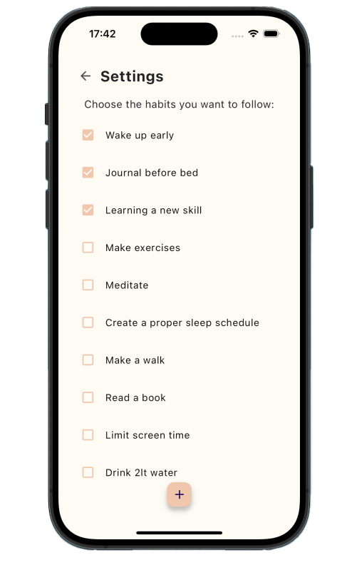

# My New Habits

## Overview

**My New Habits** is a Flutter-based app that allows users to track their habits, view progress statistics, and mark completed tasks. 
With features like personalized greetings and an interactive bar chart for habit tracking, it helps users stay motivated and consistent with their daily routines. 

- It leverages **sqflite** for local storage. 
- It uses **CircleCI** for continuous integration and deployment.
  
The app 

## Screenshots

  

  

## Features

- **Habit Management**: Add, update, and delete your daily habits.
- **Habit Progress Tracking**: Check off tasks and see your progress over time.
- **Statistics**: View completed habits for the week with an interactive bar chart.
- **Personalized Greetings**: Receive a personalized greeting based on the time of day (e.g., "Good Morning", "Good Afternoon").
- **Offline Support**: All habit data is stored locally in an SQLite database for offline access.
- **Custom Fonts**: The app features the Niconne custom font to enhance the visual appeal.

## Content Attribution

- **Font (Niconne)**: Used the Niconne font, available on [Google Fonts](https://fonts.google.com/specimen/Niconne). Designed by Vernon Adams.

## Technologies Used

- **Flutter**: Framework for building natively compiled applications.
- **Dart**: Language used to build Flutter applications.
- **sqflite**: SQLite plugin for local database storage.
- **FlChart**: Library for visualizing habit progress with beautiful bar charts.
- **intl**: Internationalization library for handling date formatting.
- **Linting**: The codebase adheres to best practices and coding standards using lint rules.
- **Widget Tests**: Extensive use of widget tests to ensure the robustness of the UI components, behaviors, and overall application functionality.
- **Widgetbook**: A UI design and testing tool to visualize, test, and document individual widgets in isolation.
- **CircleCI**: Used for continuous integration and deployment, ensuring automated builds and tests.

## Responsiveness

The app is designed to work seamlessly across various screen sizes, providing a consistent and enjoyable experience on both small and large devices.

## Future Enhancements

Add more tests.
